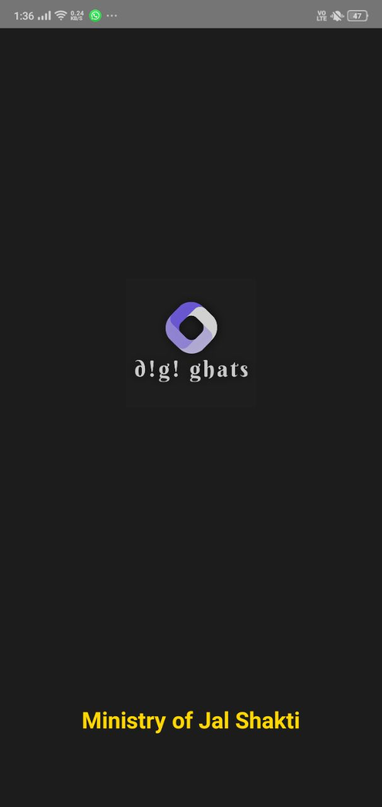
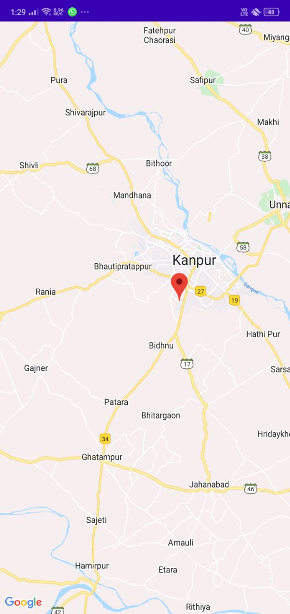

# About
“Digi Ghats” is an android application to provide information awareness about Ghats. Users who have an android phone & active internet connection can contact and start searching for Ghats Crematoria & Riverfronts along Ganga river and its Tributaries through this application. The purpose of this application is to help tourists and small vendors located on site of ghats.

# Features
Easy contact between tourists and ghats or vendors through this android application.<br>
Included:
- User Databases
- User Login & Sign up
- Awarness and list of campaigns
- Finding self-location
- Finding Near By ghats
- Employement and people throng.
       
# Tools used
- Firebase Database
- Repo from Maven ,Jcenter
- Google Maps Api
- Android Studio IDE
- Android version 4.0 or later
- Android SDK 17-28
  
# How to install?

You can install this application to test on your android smartphone. To download the signed application go to your chrome browser and copy-paste the download link:

```
https://drive.google.com/drive/folders/1VQgVW_Se3Hj-rFvghPVM0OeoQGIBVMCP?usp=sharing
```

Download will be started when you click on base.apk . After then install it on your android device.
Open the application, create an account. That's it.

N.B: It supports only in android version 4.0 or later.

# Preview:
 


 

 
 


# Contributing

If you would like to contribute in this project, you are always welcome. There is `code` available in the `master` branch.But, please `switch` to specific version and make changes there.
You must need to create pull request to that specific branch to get it merged.

Thanks


